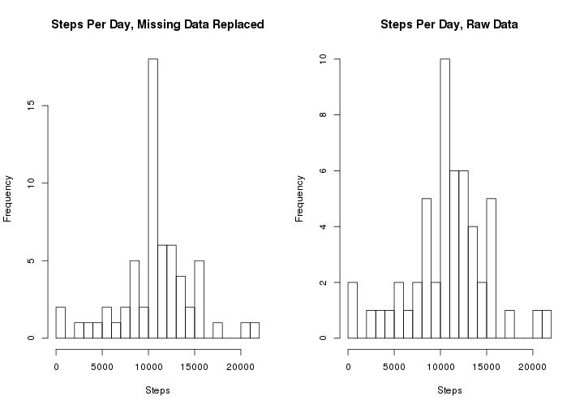
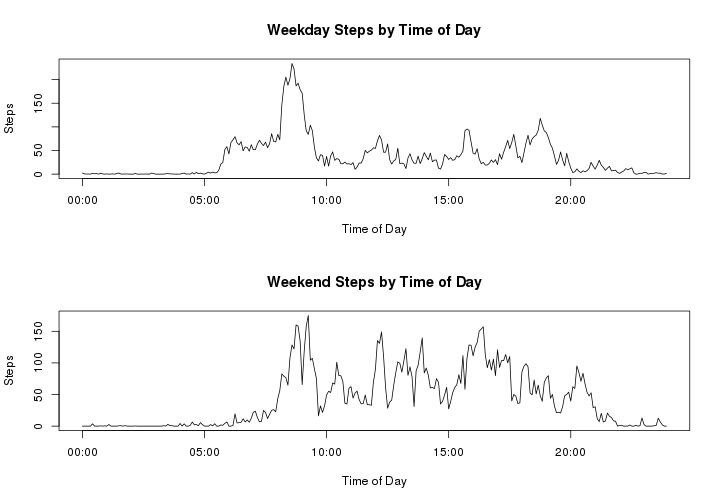

Reproducible Research: Peer Assessment 1
=============================================

The project explores a data set relating to the number of steps an individual took, recorded in five minute intervals, over a two month period.  The data is described in the assignment document as:

*It is now possible to collect a large amount of data about personal movement using activity monitoring devices such as a [Fitbit](http://www.fitbit.com/), [Nike Fuelband](http://www.nike.com/us/en_us/c/nikeplus-fuelband), or [Jawbone Up](https://jawbone.com/up). These type of devices are part of the "quantified self" movement-a group of enthusiasts who take measurements about themselves regularly to improve their health, to find patterns in their behavior, or because they are tech geeks. But these data remain under-utilized both because the raw data are hard to obtain and there is a lack of statistical methods and software for processing and interpreting the data.*

*This assignment makes use of data from a personal activity monitoring device. This device collects data at 5 minute intervals through out the day. The data consists of two months of data from an anonymous individual collected during the months of October and November, 2012 and include the number of steps taken in 5 minute intervals each day.*

The [dataset](https://d396qusza40orc.cloudfront.net/repdata%2Fdata%2Factivity.zip) is available on line. This data set consists of three fields:

   * **Steps:** the number of steps taken in each 5 minute period, Missing values are coded as NA

   * **date:** the date on which the measurement was taken YYYY-MM-DD format

   * **interval:** The five minute interval in which the data measurement was taken.


The data set is a csv file with a total of 17,568 observations.


## Load and preprocess the data
   Show all code necessary to:

   1. *Load the data (ie **read.csv()**)*

       
       ```r
       unzip("activity.zip")
       rawData <- read.csv("activity.csv")
       file.remove("activity.csv")
       ```
       
       ```
       ## [1] TRUE
       ```

       Basic data overview

       
       ```r
       head(rawData)
       ```
       
       ```
       ##   steps       date interval
       ## 1    NA 2012-10-01        0
       ## 2    NA 2012-10-01        5
       ## 3    NA 2012-10-01       10
       ## 4    NA 2012-10-01       15
       ## 5    NA 2012-10-01       20
       ## 6    NA 2012-10-01       25
       ```
       
       ```r
       summary(rawData)
       ```
       
       ```
       ##      steps                date          interval     
       ##  Min.   :  0.00   2012-10-01:  288   Min.   :   0.0  
       ##  1st Qu.:  0.00   2012-10-02:  288   1st Qu.: 588.8  
       ##  Median :  0.00   2012-10-03:  288   Median :1177.5  
       ##  Mean   : 37.38   2012-10-04:  288   Mean   :1177.5  
       ##  3rd Qu.: 12.00   2012-10-05:  288   3rd Qu.:1766.2  
       ##  Max.   :806.00   2012-10-06:  288   Max.   :2355.0  
       ##  NA's   :2304     (Other)   :15840
       ```
       There are indeed 17,568 records.  **Note: This total was calculated with an in line r command, see .rmd file.**

   1. *Process/transform the data (if necessary) into a format suitable for your analysis*

       This process will take part in several places.  When appropriate I will
       * aggregate the data several ways
       * Transform to compute the time interval as a time
       * replace NAs with other values

       I will, however, postpone this action until the data is needed so that the transformation is near where it is used to improve readability.

## What is the mean total number of steps taken per day?

   For this part of the assignment, you can ignore the missing values in the data set.

   1. *Calculate the total number of steps taken per day.*

       Start by computing the aggregate steps per day. 

       
       ```r
          stepsPerDay <- aggregate(rawData$steps, by=list(rawData$date), FUN=sum)
          library(plyr)
          stepsPerDay <- rename(stepsPerDay, c("Group.1" = "Day", "x"="Steps"))
       ```

       Data overview:

       
       ```r
           head(stepsPerDay)
       ```
       
       ```
       ##          Day Steps
       ## 1 2012-10-01    NA
       ## 2 2012-10-02   126
       ## 3 2012-10-03 11352
       ## 4 2012-10-04 12116
       ## 5 2012-10-05 13294
       ## 6 2012-10-06 15420
       ```

   1. *If you do not understand the difference between a histogram and a barplot, research the difference between them.  Make a histogram of the total number of steps taken each day*

       
       ```r
       hist(stepsPerDay$Steps, breaks=20, xlab="Steps", main="Steps Per Day, Raw Data")
       ```
       
       

   1. *Calculate and report the mean and median of the total number of steps taken per day.*

       Mean steps per day 10,766.19

       Median steps per day 10,765

       **Note: both of the above  were calculated with in line r code, that is just too cool!**

## What is the average daily activity pattern?

   1. *Make a time series plot (i.e. type = "l") of the 5-minute interval (x-axis) and the average number of steps taken, averaged across all days (y-axis)*

	Start off by aggregating the steps per interval.

	
	```r
	stepsPerInterval <- aggregate(rawData$steps, by=list(rawData$interval), FUN=mean, na.rm=TRUE)
	stepsPerInterval <- rename(stepsPerInterval, c("Group.1" = "Interval", "x"="Steps"))
	
	# add a time field.  We only want the hour and minute 
	# so just just the beginning of the epoch for the day.
	stepsPerInterval$Time = as.POSIXct( as.integer(stepsPerInterval$Interval/100)*3600
	 			      +stepsPerInterval$Interval%%100*60, origin = "1970-01-01",tz="GMT")
	```

	Now draw the graph

	
	```r
	plot(stepsPerInterval$Time, stepsPerInterval$Steps, 
	      type="l", xlab="Time of Day", ylab="Steps", main="Average Steps by Time of Day")
	```
	
	

   1. *Which 5-minute interval, on average across all the days in the dataset, contains the maximum number of steps?*

    
    ```r
    maxSteps = max(stepsPerInterval$Steps)
    maxWhen = format(stepsPerInterval[stepsPerInterval$Steps == max(stepsPerInterval$Steps),]$Time,"%H:%M")
    ```
       The maximum average steps is 206.1698113, at 08:35.

## Imputing missing values

   Note that there are a number of days/intervals where there are missing values (coded as NA). The presence of missing days may introduce bias into some calculations or summaries of the data.

   1. *Calculate and report the total number of missing values in the dataset (i.e. the total number of rows with NAs)*

    
    ```r
    myTot = 0;
    for (i in names(rawData)) {
        tot = sum(is.na(rawData[[i]]))
        cat (i , " has " , prettyNum(tot, big.mark=",") , "NAs\n")
        myTot <-  tot+ myTot
    }
    ```
    
    ```
    ## steps  has  2,304 NAs
    ## date  has  0 NAs
    ## interval  has  0 NAs
    ```

   The total number of NAs in the data is 2,304.

   1. *Devise a strategy for filling in all of the missing values in the dataset. The strategy does not need to be sophisticated. For example, you could use the mean/median for that day, or the mean for that 5-minute interval, etc.*

    All of the NAs seem to be in the step count, so I will replace the NA values with the average of the steps for the matching interval.  

   1. *Create a new dataset that is equal to the original dataset but with the missing data filled in.*

    
    ```r
    # ok, so there is probably a better way to do this step in fixed format
    # but I don't know it and I am running out of time, 
    # besides, I spent a long time learning how to program.
    # loop over every row, 
    #    if it has an NA 
    #       replace the NA with a table lookup
    
    newData <- rawData
      
    for (i in 1:nrow(newData)) {
        if (is.na(newData[i,1])) {
          newData[i,1] <-  stepsPerInterval[stepsPerInterval$Interval==newData[i,3],2]
        }
    }
    ```


   1. *Make a histogram of the total number of steps taken each day and Calculate and report the mean and median total number of steps taken per day. Do these values differ from the estimates from the first part of the assignment? What is the impact of imputing missing data on the estimates of the total daily number of steps?*
    
    ```r
    #aggregate the number of steps by day.
    newStepsPerDay <- aggregate(newData$steps, by=list(newData$date), FUN=sum)
    
    # rename the aggrigate fields
    newStepsPerDay <- rename(newStepsPerDay, c("Group.1" = "Day", "x"="Steps"))
    
    # draw the histogram, add a reasonable x axis label.
    par(mfrow=c(1,2))
    hist(newStepsPerDay$Steps, breaks=20, xlab="Steps", main="Steps Per Day, Missing Data Replaced")
    hist(stepsPerDay$Steps, breaks=20, xlab="Steps", main="Steps Per Day, Raw Data")
    ```
    
    

    As noted in the titles, the new histogram on the left has NAs replaced with the average value, while the one on the right was the raw data with NAs present.  As expected the number of days with the mean number of steps went up as it data appeared to be missing for full days.

    
    ```r
    # calculate the stats
    meanSteps = mean(stepsPerDay$Steps, na.rm=TRUE);
    medianSteps = median(stepsPerDay$Steps, na.rm=TRUE)
    newMeanSteps = mean(newStepsPerDay$Steps, na.rm=TRUE)
    newMedianSteps = median(newStepsPerDay$Steps, na.rm=TRUE)
    ```

    In the original data the average per day is 10,766.19 and the median is 10,765.  In the new data the average steps per day is 10,766.19 and the new median is 10,766.19.  The mean changed by 0 as expected, and the median changed by -1.19.

## Are there differences in activity patterns between weekdays and weekends?**

   For this part the weekdays() function may be of some help here. Use the dataset with the filled-in missing values for this part.

   1. *Create a new factor variable in the dataset with two levels "weekday" and "weekend" indicating whether a given date is a weekday or weekend day.*

   I decided to go back to using the raw data for this.  Replacing rawData with newData, computed above, would perform the same calculations with the NAs replaced.    If time permitted, it looks like this should be turned into a function as the code is essentially a repeat of the work above. 

    
    ```r
    # Add a new factor
    rawData$Day <- factor(weekdays(as.POSIXct(rawData[,2])))
    rawData$WeekEnd <- rawData[,4] %in% c("Saturday","Sunday")
    
    # compute the data for weekends
    weekendData = rawData[rawData$WeekEnd,]
    weekendStepsPerInterval <- aggregate(weekendData$steps, 
         by=list(weekendData$interval), FUN=mean, na.rm=TRUE)
    weekendStepsPerInterval <- rename(weekendStepsPerInterval, c("Group.1" = "Interval", "x"="Steps"))
    weekendStepsPerInterval$Time = as.POSIXct(as.integer(weekendStepsPerInterval$Interval/100)*3600
          +weekendStepsPerInterval$Interval%%100*60, origin = "1970-01-01",tz="GMT")
    
    # repeat for weekdays
    weekdayData = rawData[!rawData$WeekEnd,]
    weekdayStepsPerInterval <- aggregate(weekdayData$steps, 
         by=list(weekdayData$interval), FUN=mean, na.rm=TRUE)
    weekdayStepsPerInterval <- rename(weekdayStepsPerInterval, c("Group.1" = "Interval", "x"="Steps"))
    weekdayStepsPerInterval$Time = as.POSIXct(as.integer(weekdayStepsPerInterval$Interval/100)*3600
          +weekdayStepsPerInterval$Interval%%100*60, origin = "1970-01-01",tz="GMT")
    ```

   1. *Make a panel plot containing a time series plot (i.e. type = "l") of the 5-minute interval (x-axis) and the average number of steps taken, averaged across all weekday days or weekend days (y-axis). See the README file in the GitHub repository to see an example of what this plot should look like using simulated data.*


   
   ```r
   par(mfrow=c(2,1))
   plot(weekdayStepsPerInterval$Time, weekdayStepsPerInterval$Steps, type="l", 
          xlab="Time of Day", ylab="Steps", main="Weekday Steps by Time of Day")
   plot(weekendStepsPerInterval$Time, weekendStepsPerInterval$Steps, type="l", 
          xlab="Time of Day", ylab="Steps", main="Weekend Steps by Time of Day")
   ```
   
   

   It appears that there is a different activity pattern for weekends and weekdays.  The subject seems to be much more active for the entire day during a weekend.
